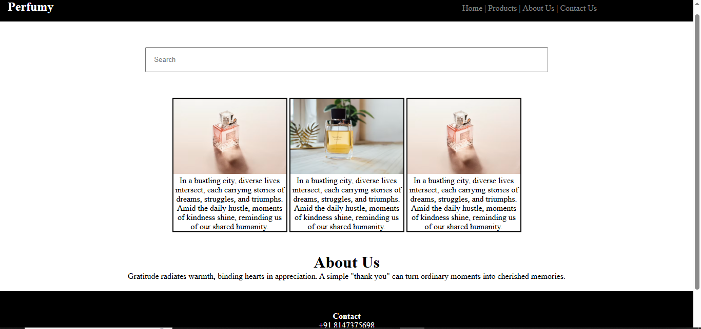

# 💐 Perfumy - Perfume Website Frontend

**Perfumy** is a responsive and elegant perfume product landing page developed using HTML, CSS, and JavaScript. It is designed to showcase premium fragrance collections with a modern and clean user interface.

## 🔗 Live Demo

👉 [Click here to view the live site](https://selvarajan-m.github.io/Perfummy-Project/)

---

## 🛠️ Tech Stack

- ✅ HTML5  
- ✅ CSS3  
- ✅ JavaScript (Vanilla)

---

## 📸 Features

- ✨ Responsive design for all devices  
- 🧴 Product showcase and promotional sections  
- 🎨 Aesthetic visuals and smooth layout  
- 🖱️ Interactive buttons and smooth scrolling  
- 🌐 GitHub Pages hosting for easy access

---

## 🚀 How to Run Locally

1. **Clone the repository**:
   ```bash
   git clone https://github.com/Selvarajan-M/Perfummy-Project.git
   ```

2. **Navigate to the folder**:
   ```bash
   cd Perfummy-Project
   ```

3. **Open `index.html` in your browser**

> ✅ No installations or additional setup needed.


## 📸 Screenshot



## 👨‍💻 Author

**Selvarajan M**  
GitHub: [@Selvarajan-M](https://github.com/Selvarajan-M)

---

⭐️ If you liked this project, consider starring the repository!
